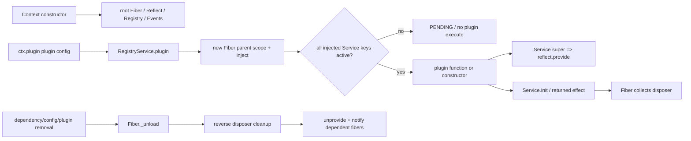

# Cordis v4：作为数字生命平台的 composition kernel 研究报告

> **研究对象**：`/home/workspace/references/cordis`（源码声明版本 `4.0.0-rc.8`）。
>
> **Athena 比较基准**：`/home/workspace/athena-harness` 当前代码及正式 `docs/00`–`06`；未以 `.specify/specs/` 的废弃草案作为架构事实。
>
> **结论标签**：**[已实现事实]** 为当前代码直接可验证；**[文档计划]** 为 Athena 正式文档明确但尚未实现；**[代码推断]** 为由已验证实现机制得到的有限结论；**[无法确认]** 为当前材料不能证实的事项。

## 执行摘要

**[已实现事实]** Cordis 不是数字生命、Agent、LLM 或 IM runtime；它是以 `Context` 原型链、Service key、Fiber、effect、事件和 loader tree 组织任意 Node.js 组件的 composition kernel。它将「插件可否激活」还原为 Service 可见性和 `inject` 满足性，将「何时释放」还原为 Fiber 收集的 disposer 逆序执行。该底层能力非常适合 Athena 构造多 Life、多 capability 的拓扑，但不会替 Athena 规定人格连续性、认知循环、跨事件串行化、Memory 语义、权限、租户边界或 LLM observability。

**[代码推断]** Athena 的方向正确：将 `life`、`cortex`、`message`、`satori` 作为 isolated Service key，借 Cordis 原语表达多实例图，而不额外发明 ID-based wiring。但是，若继续把 Cordis 的进程内 isolate 误当作安全/资源隔离，或把 loader 的可重载性误当成 Cortex 可热切换性，平台会在多生命、持续运行和可观测性要求上出现语义裂缝。

## 关键结论与证据索引

| # | 结论及标签 | 主要证据（路径 / symbol / 行） |
| --- | --- | --- |
| 1 | **[已实现事实]** 根 `Context` 构造一个代理根、root Fiber、`ReflectService`、`RegistryService`、事件与 logger；子 scope 用原型链 `extend()` 创建。 | `references/cordis/packages/core/src/context.ts`：`Context.constructor` L36–48，`Context.extend` L55–63。 |
| 2 | **[已实现事实]** `Service` 构造阶段立即通过 `reflect.provide(name, self)` 把实例绑定到 Service key；该 registration 归入当前 Fiber。 | `references/cordis/packages/core/src/service.ts`：`Service.constructor` L18–35；`reflect.ts`：`ReflectService.provide` L175–203。 |
| 3 | **[已实现事实]** `inject` 不满足时 Fiber 进入非激活状态；服务出现/消失会 notify 依赖 Fiber，并触发 unload/reload。 | `references/cordis/packages/core/src/reflect.ts`：`notify` L205–227；`fiber.ts`：`Fiber._refresh` L385–397、`_setEpoch` L399–413、`_reload` L415–435。 |
| 4 | **[已实现事实]** 插件 application 是 `RegistryService.plugin → new Fiber → callback/constructor → [Service.init]`；`inject` 是一个插件 Fiber，不是另造的依赖容器。 | `registry.ts`：`RegistryService.inject` L189–191、`plugin` L193–213；`fiber.ts`：constructor L122–199、runner `execute` L146–162。 |
| 5 | **[已实现事实]** 生命周期资源统一通过 `fiber.effect()` 收集；子资源以注册逆序 release；Fiber unload 会处理每个 disposer 并记录错误。 | `fiber.ts`：`effect` L275–340、`_unload` L437–458。 |
| 6 | **[已实现事实]** isolate 为 Context 的某个 Service name 换 Symbol，影响 `provide/get` store key；而 accessor/mixin 使用全局字符串 `props`，不随 isolate 多实例化。 | `context.ts`：`isolate` L65–69；`reflect.ts`：`store/props` L135–148、`provide` L175–203、`accessor/mixin` L229–265。 |
| 7 | **[已实现事实]** loader 维护可递归的 `EntryTree`，按 entry 动态 import 模块并创建 Fiber；entry 更新、禁用、删除会 dispose/reload 对应 Fiber。 | `loader/src/config/tree.ts`：`EntryTree` L6–122；`entry.ts`：`Entry.update` L100–134、`_init` L158–172；`group.ts`：L47–87。 |
| 8 | **[已实现事实]** loader isolate 支持 entry-local (`true`) 和 label-shared realm；变更 isolate map 后尝试平移 service impl 并 notify 受影响依赖。 | `loader/src/config/isolate.ts`：`Realm` L25–65，默认 `isolate()` L67–149。 |
| 9 | **[已实现事实]** Athena 已将 `Life`/`Cortex` 的 one-per-Life 生命周期与 Cordis Service/Fiber 连接，且实际 `cortex-chat` 通过 required `life,message` token 激活。 | `packages/protocol/src/cortex.ts`：`Cortex.[Service.init]` L3–13；`plugins/life/src/life.ts`：`Life.bind` L21–46；`plugins/cortex-chat/src/index.ts` L15–44。 |
| 10 | **[已实现事实]** Athena 的 `MessageService` 已利用 Cordis isolate 与 `[Context.filter]` 限制 Satori session 的投递 scope；`ctx.satori` 在 group 内由 sibling adapter 共享。 | `plugins/capability-message/src/index.ts`：`MessageService.constructor` L28–69；`docs/02-architecture.md` §3.1 L203–211、§4.1 L215–224。 |
| 11 | **[已实现事实]** Athena 的 AI provider 插件已用 `inject:['ai']` 与 `ctx.effect()` 注册/注销 provider；但 LLM 尚未接入 Cortex。 | `plugins/provider-openai/src/index.ts` L6–32；`docs/06-progress-and-roadmap.md` L59–68、L231–245。 |

---

## 1. 项目定位与核心抽象

### Cordis

**[已实现事实]** Cordis core package 自称 “Meta-Framework for Modern Applications”，发布物为 ESM 库与 `bin.js`，并将 loader/include 列为 optional peer；说明应用 composition 可只使用 core，不强制携带配置加载或 CLI。证据：`references/cordis/packages/core/package.json` L2–16、L33–48。

其核心抽象并非 domain entity，而是五个通用运行时部件：

1. **Context**：代理对象；原生成员优先，未声明的动态属性由 `ReflectService` 解析。每个子 Context 通过原型链拥有上层可见性。`Context.constructor/extend`，`context.ts` L36–63；`ReflectService.handler.get`，`reflect.ts` L61–98。
2. **Service key / provide**：字符串 name 是依赖契约，实际存储槽为 isolate map 对应的 Symbol。Service 不是由中心容器显式 `register()`，而是实例构造时 `super(ctx, name)` 注册。`service.ts` L18–35；`reflect.ts` L175–191。
3. **Plugin / Registry**：Plugin 可以是 function、constructor、或有 `apply()` 的对象；Registry 对同一 callback 聚合 runtime，但每次 application 得到独立 Fiber。`registry.ts` L7–10、L63–111、L193–213。
4. **Fiber / Effect**：每个 plugin application 是一个依赖感知、可 reload、可 dispose 的 Fiber。`fiber.ts` L103–213。
5. **Entry tree（可选 loader 层）**：把 declarative entry 的 name/config/group/disabled/inject 等转化为由 loader 追踪的 Fiber tree。`loader/src/config/entry.ts` L8–15、L34–50；`tree.ts` L6–45。

**[代码推断]** 这套抽象为 Athena 带来的主要收益不是“插件多”，而是把世界连接、Life identity、Cortex strategy 和共享基础设施均表达成同一种组合图；不同产品可以改 tree 而不修改一个中心 runtime。限制同样清晰：Service key 只表示“一个可解析的能力”，不表达 Life 的身份所有权、Cortex 的完整性或行为语义，后者必须留在 Athena protocol / Life / Cortex 中。

### Athena 对照

**[已实现事实]** Athena 已在正式定位中明确 Cordis 仅为 Layer 0 的 DI / lifecycle 基础设施，Athena 的领域原语是 Life、Cortex、Nerve。`docs/02-architecture.md` L7–25；`docs/00-overview.md` L9–37。`@athena-ai/core` 当前仅是 `cordis`、`cosmokit`、`Schema` 重导出和空 `apply()`，不应被误表述为已经实现的生命平台内核。`packages/core/src/index.ts` L1–12；`docs/02-architecture.md` L64–66。

---

## 2. 事件输入与世界接口

### Cordis

**[已实现事实]** Cordis Events 只提供 generic event dispatch。`emit` 同步逐 listener 调用；`parallel` 使用 `Promise.allSettled` 后将失败合并成 `AggregateError`；`serial` 逐个 await 并可 bail；`waterfall` 是显式 `next()` middleware 链。`references/cordis/packages/core/src/events.ts`：`DispatchMode` L14，`EventsService._resolve` L72–81，`parallel` L89–94，`emit` L96–99，`serial/bail/waterfall` L101–126。hook 注册本身由 Fiber effect 管理，因此 listener 随其插件自动移除，`register/on` L128–158。

**[已实现事实]** 事件 filter 是 Context-level hook selection：dispatch 读取 `thisArg[Context.filter]`，仅将事件交给匹配的非-global hook。`events.ts` L72–81。这是 scope routing 原语，不是协议定义、消息 schema、队列或 delivery guarantee。

**[代码推断]** Cordis 为上层提供“来自任意世界的事件可按生命周期与 scope 注册/注销”的接口，但没有 backpressure、顺序、at-least-once / exactly-once、持久 mailbox 或 sensor/actuator 抽象。因此它适合 Nerve 将外部输入映射为命名事件；输入重放、排序、幂等、跨重启恢复必须由对应 capability / Cortex 负责。

### Athena 对照

**[已实现事实]** Athena 已经使用 `MessageService` 将 Satori 的 `internal/session` 转成仅对应 `message` isolate 的事件订阅目标：它先比较原始 Bot 所在的 `satori` symbol，再写入 `session[Context.filter]`。`plugins/capability-message/src/index.ts` L45–68。`CortexChat` 用 `ctx.on("message")` 输入，用 `ctx.message.createMessage()` 输出，实际仍是 echo skeleton。`plugins/cortex-chat/src/index.ts` L25–44。

**[已实现事实]** Athena 的正式设计刻意采用 push-based：Nerve/Capability emit Cordis event，Cortex 自己决定 buffer、mailbox 或 debounce；框架不提供统一 queue。`docs/01-design-philosophy.md` L177–228；`docs/05-lessons-learned.md` L206–246。

**[代码推断]** 这与 Cordis event 语义一致，但也把 per-channel serial lock、event ordering、deduplication、shutdown drain 和 long-running loop failure containment 归入每个 Cortex 的责任。不能仅因 Cordis 有 `serial()` 就推导出 chat cognition 已被串行化：`serial()` 只描述一次 event dispatch 的 listener 顺序，不能替代跨输入的工作队列。

---

## 3. 上下文与状态模型

### Cordis

**[已实现事实]** Context scope 是原型链：`extend()` 创建 traceable parent 的派生对象；`isolate(name)` 在新的 isolate map 中把该 name 映射为新 Symbol。`context.ts` L55–69。服务 lookup 从当前 Fiber / parent Fiber 逐层向上，遇到已 `inject` 但不 active 的 service 会抛错；因此 Context 的可见性及依赖显式性同时生效。`reflect.ts` L71–97。

**[已实现事实]** `provide()` 将 service 放在 `ReflectService.store[key]`，并把当前 Fiber 自己提供的 impl 写入 `fiber.store`；同一 Symbol slot 不允许两个 service。service 移除时先删除全局 store、notify consumers、等待相关 fibers，再删除自身 Fiber 的 store。`reflect.ts` L175–203。

**[已实现事实]** `accessor()` / `mixin()` 不进入 Symbol store，而进入 root `props` 的 string-key namespace；重名会立即报错。`reflect.ts` L135–148、L229–265。

**[代码推断]** Cordis isolate 是**命名空间/依赖解析隔离**，不是 memory、CPU、network、权限或错误域隔离。不同 isolate 中的 service 可以并存并有不同可见性；它们仍在同一个 Node process、同一个 event loop、同一个 global accessor registry 中。把它用作多 Life 的 topology boundary 有效；把它宣称为租户安全 sandbox 则不成立。

### Athena 对照

**[已实现事实]** Athena 已把 per-Life group 设计为 `isolate: { life, cortex, message, satori }`，并记录四个 token 均需隔离的具体原因。`docs/02-architecture.md` L215–289；`docs/05-lessons-learned.md` L80–120。实际 `Life` 提供 `life`，并由 `bind()` 强制一个当前 Cortex；它自身 Memory 仍是 in-memory `Map` stub。`plugins/life/src/life.ts` L4–18、L21–52。

**[已实现事实]** Athena 已避开 `ctx.mixin()` 多实例陷阱：正式经验文档基于 Cordis `props` 全局字典指出 isolate 不会隔离 accessor，要求新 Service 避免 mixin。`docs/05-lessons-learned.md` L9–76；Cordis 原始实现参见 `reflect.ts` L229–265。

**[代码推断]** Athena 在“Context scope = Life deployment scope”上已正确使用 Cordis，但仍需把**identity state**（persona、persistent Memory、self-model）视为独立于 Context 进程生命周期的领域状态。否则 plugin reload / process restart 仍会让 Life 退化为配置加内存对象；Cordis 不能自动补足该连续性。

---

## 4. 核心认知与 LLM 调用

### Cordis

**[已实现事实]** Cordis core 的 runtime source 中没有 LLM client、prompt、memory store、persona、tool loop 或 token/cost telemetry 的领域抽象；其 core exports 仅 Context/events/fiber/logger/registry/service/utils。`references/cordis/packages/core/src/index.ts` L1–7。这个结论是“被刻意不负责”，而非“能力缺失”：它允许任意 LLM service 用普通 Service key / lifecycle 安装，但不决定模型协议与认知语义。

**[代码推断]** Cordis 能提供的最合理层次是：AI provider 或 registry 由 Service key 暴露；某个 Cortex 通过 `inject` 获取其契约；调用所产生的 timer/socket/listener 通过 effect 释放；模型注册发生变化可重新激活依赖 fiber。它不能决定 candidate policy、model failover、prompt assembly、tool authorization、memory retrieval、上下文压缩或生成失败后的产品行为。

### Athena 对照

**[已实现事实]** Athena 已实现 root-level `AIService`（`ctx.ai`）及 provider registry / `models.yml` 解析；包元数据把 `ai` 声明为 implements。`packages/ai/package.json` L30–40；`packages/ai/src/service.ts`（`AIService`）L22–31、L78 起；`docs/06-progress-and-roadmap.md` L15–18。OpenAI provider 是 reusable plugin，`inject=["ai"]` 后调用 `ctx.ai.register()`，以 `ctx.effect()` 解除注册。`plugins/provider-openai/src/index.ts` L6–32。

**[已实现事实]** 当前 Cortex 未使用 `ctx.ai`：`CortexChat` inject 只有 `life,message`，消息处理仅 echo；正式 roadmap 也明确 Cortex 侧 AI SDK integration 尚未完成。`plugins/cortex-chat/src/index.ts` L15–44；`docs/06-progress-and-roadmap.md` L59–65、L231–245。

**[代码推断]** 正确的下一层边界是“AIService 负责模型发现/解析，Cortex 负责 cognition 与 failover policy”，而不是把 `generateText` loop 移到 Cordis 或 AIService。这维持 Cortex 为完整生存策略，也允许 Reactive、World、Narrative 使用不同的认知形状。

---

## 5. 行动输出与反馈闭环

### Cordis

**[已实现事实]** Cordis 不定义 action protocol。它能让插件暴露 Service method、用 event 汇集 hook，或由 effect 管理 action handler 的释放；无法从 runtime 核心推导任何“action 已送达/已执行/可回滚”的业务保证。Service 提供/查找：`reflect.ts` L150–203；event modes：`events.ts` L89–126。

**[代码推断]** 对 Athena 而言，应把 Nerve/Capability 的 act method 作为世界接口，让 Cortex 对 action request、result、failure、retry、compensation 负责语义。不可用 Cordis `emit` 的“调用过 listener”替代外部世界的 delivery acknowledgment。

### Athena 对照

**[已实现事实]** 当前 chat 输出经 `ctx.message.createMessage()`，且单次异常只 warn，避免直接杀掉 Cortex handler。`plugins/cortex-chat/src/index.ts` L31–43。Sandbox Nerve 的 Hub 注册和每个 SandboxBot Fiber 都有 dispose 逻辑，具体映射了 Cordis effect 到外部连接资源。`plugins/sandbox-nerve/src/index.ts` L26–47、L122–143。

**[文档计划]** Roadmap 指定 Cortex chat 的 Layer 2 action（`send_message`、`wait`）、Layer 3 tool、Hook 以及无输出时静默，但没有将其作为当前已实现能力。`docs/06-progress-and-roadmap.md` L231–245。

---

## 6. 生命周期、并发与可靠性

### Cordis

### 核心启动、plugin application 与释放关系链

**[已实现事实]** 该关系链的逐段源码依据为：根 Context 初始化 `context.ts` L36–48；插件创建 `registry.ts` L193–213；Fiber constructor 的 inject snapshot、Plugin execute、parent effect 纳管 `fiber.ts` L122–199；Service provide `service.ts` L18–35；effect disposal `fiber.ts` L275–340；reload/unload `fiber.ts` L399–458。

**[已实现事实]** `Fiber` 在 required `inject` 缺失时把 epoch 设为 `INACTIVE`，不执行插件；服务加入/移除时 `ReflectService.notify()` 重新检查引用该 key 的 Fiber。`fiber.ts` L371–413；`reflect.ts` L205–227。`ctx.inject(inject, callback)` 实际只是 registry 上创建一个匿名 plugin Fiber。`registry.ts` L189–191。

**[已实现事实]** reliability 的隔离粒度是 Fiber：插件执行/reload 的异常会写 logger 并标记该 Fiber failed/inactive，不由这些代码直接终止整个 root runtime。`fiber.ts` L415–435；unload 清理异常也记录为 logger error 后继续其他 disposer，L437–458。**[无法确认]** 当前证据未覆盖 CLI supervisor 的进程级重启策略、production crash policy 或跨进程 recoverability，不能据此断言 Cordis 提供完整 daemon reliability。

**[已实现事实]** events 默认 `emit()` 同步调用，不 await listener；`parallel()` 才收集异步失败，`serial()` 是一次 dispatch 内的顺序。这意味着 Fiber lifecycle 自动释放监听器，但不自动串行化异步业务工作。`events.ts` L89–126、L128–158。

### Loader 与动态配置树

**[已实现事实]** Loader 将 entry tree 映射为 Fiber：`Entry._init()` import entry name，unwrap exports 后调用 `registry.plugin(plugin, resolvedConfig)`；`Entry.update()` 对 disabled entry dispose fiber，对既有 fiber 的差异调用 `_patchContext` / `fiber.update()`。`loader/src/config/entry.ts` L100–134、L146–172。EntryGroup 对增删改并发 `Promise.all`，remove 则 dispose entry fiber。`group.ts` L19–70。

**[已实现事实]** Include 可以从 YAML/JSON/module 读取 config，初始 `Service.init` 里 build entry tree，并在释放时 `root.stop()`；refresh 重新读取并 update tree。`packages/include/src/index.ts` L85–99、L166–190。

**[代码推断]** 这是“配置驱动的 plugin 热重载/树变更”能力，不是状态迁移协议。若某插件持有 websocket、timer、buffer 或未持久化 cognition state，正确性取决于它是否把所有外部资源实现为 disposer、以及应用是否定义 reload 时 state transfer。Fiber 只能保证调用 disposer，不保证领域状态等价。

### Athena 对照

**[已实现事实]** Athena 现有 Cortex base 的 `[Service.init]()` 将 `life.bind(this)` 返回的 disposer yield 给 Fiber；测试覆盖 bind、dispose 后 unbind、重复 Cortex 失败和缺 Life 不激活。实现：`packages/protocol/src/cortex.ts` L3–13；测试：`packages/protocol/tests/cortex.spec.ts` L13–54。多 Life 文档也记录 group dispose 时 Cortex disposer 先触发再释放 Life。`docs/02-architecture.md` L215–225。

**[已实现事实]** Athena 使用 provider `ctx.effect()` 解除注册、SandboxNerve effect 回收 Hub registration 与 child bot Fibers，属于正确的 Cordis resource ownership 用法。`plugins/provider-openai/src/index.ts` L29–32；`plugins/sandbox-nerve/src/index.ts` L26–47。

**[代码推断]** Athena 不能借 Cordis 默认行为声称“Cortex 并发安全”：未来 chat 的同 channel lock / grouping、world heartbeat 的停止协调、Interlude debounce cancel 和 LLM abort 都需要在每个 Cortex 的 effect-owned resources 中明确实现。正式 roadmap 已把 per-channel serial lock 列为验收目标，说明这是尚未实现部分。`docs/06-progress-and-roadmap.md` L247–255。

---

## 7. 扩展性与平台化能力

### Cordis

**[已实现事实]** 运行时 extension 的基本形式为：插件用 `static inject`/`inject` 声明 prerequisites，通过 `Service` provide key 发布能力，或以 plain `apply()` 注册副作用；Registry 为每个 installation 创建 Fiber。`registry.ts` L63–111、L189–213；`service.ts` L18–35。Context `intercept(name, config)` 把 config 叠入 context scope，Service 的 `resolveConfig()` 沿 intercept 原型链合成配置。`context.ts` L71–77；`service.ts` L51–67。

**[已实现事实]** loader extension 的结构是树而非平面 list：entry 可形成 group/subtree、能够 import named plugins、persist/update/remove entries。`loader/src/config/tree.ts` L25–120；`loader/src/config/group.ts` L47–87。isolate realm 可为某 entry 专有（`true`）或跨 entry 按 label 共享。`loader/src/config/isolate.ts` L67–85。

**[代码推断]** Cordis 对“可组合平台”特别适合的部分是依赖图、作用域与可卸载资源；它并不提供 capability catalog、semantic version compatibility、permission model、plugin provenance、configuration migration、resource quotas 或 cross-process tenancy。把 `package.json` `cordis.service` metadata 当 runtime enforcement 也不正确：runtime 的实质约束来自 JS `inject`/`provide` 和 Fiber；metadata 至多服务于 loader/WebUI 生态的发现（Athena 文档亦如此说明：`docs/03-code-conventions.md` L200–227）。

### Athena 对照

**[已实现事实]** Athena 已把 Service key 用作 capability token，而不是将 Cortex 绑定具体 adapter：`cortex-chat` inject `life,message`；其包元数据也声明 required token。`plugins/cortex-chat/src/index.ts` L15–29；`plugins/cortex-chat/package.json` L27–37。正式架构规定 Cortex 永不依赖 Nerve/adapter，Nerve 向 capability 注册。`docs/02-architecture.md` L142–149；`docs/01-design-philosophy.md` L149–173。

**[已实现事实]** Athena 已使用 `reusable=true` provider plugin，支持同一 provider plugin 的多实例（不同 id）；AIService registry 防止重复 id。`plugins/provider-openai/src/index.ts` L6–32；`packages/ai/src/service.ts` `register` L125–144（由代码图直接读取）。

**[文档计划]** `ctx.tools` 的 scoped discovery（local → life → global）与 Layer 3 tool registry 尚未实现。`docs/06-progress-and-roadmap.md` L193–208、L258–281。它是将 Cordis Context scope 转化为数字生命 capability scope 的关键平台层，不应误计入 Cordis 自动提供的能力。

---

## 8. 工程质量与风险

| 风险 | 事实边界与证据 | 对 Athena 的含义 |
| --- | --- | --- |
| Service key 冲突 | **[已实现事实]** 同 Symbol store slot 的第二次 `provide` 抛错；`reflect.ts` L175–191。 | 多 Life 必须 isolate 每个 per-Life key；`life/cortex/message/satori` 当前已有该设计。 |
| 全局 accessor/mixin 冲突 | **[已实现事实]** `props` 是 root string dictionary，`accessor()` 重名即抛；`reflect.ts` L135–148、L229–265。 | 不要将三方 `mixin()` 视作 isolate-safe；Athena 已 patch Satori 并在经验文档中禁止该模式。 |
| Proxy identity / `this.ctx` 重绑定 | **[已实现事实]** Reflect 将返回值 trace 到 receiver Context；`reflect.ts` L67–98、L267–280。**[已实现事实]** Athena 实际为 MessageService 保存 `_self` 并 unwrap `cordis.original`，避免读错 Satori domain。`plugins/capability-message/src/index.ts` L13–24、L31–74。 | 禁止以 `===` 比 service proxy；需要构造 scope 时保留原 Context；具体模式已在 Athena 文档登记。 |
| 异步工作并发 | **[已实现事实]** event `emit()` 不 await；`events.ts` L96–99。 | 每个 Cortex 负责 locks/queues/cancellation；不要从 DI lifecycle 外推 execution serialization。 |
| reload 与领域连续性 | **[已实现事实]** loader 可 dispose/update/reload Fiber；`entry.ts` L100–172，`fiber.ts` L399–458。 | reload 只能回收资源，不能保存 in-memory Memory / cognition buffer；更新 Cortex 不能宣称无缝热切换。 |
| 错误可见性 | **[已实现事实]** Fiber 将 execute/unload error 打 logger；`fiber.ts` L421–425、L437–458。 | logger 是底层诊断而非 digital-life Execution Record；Athena 的 Execution Record 仍未设计。`docs/06-progress-and-roadmap.md` L66–68。 |
| 进程/安全隔离误用 | **[代码推断]** isolate 的实现在共享 `ReflectService.store` 与 Symbol map 上换 key；`context.ts` L65–69，`reflect.ts` L135–203。 | isolate 不隔离 secret、CPU、network 或 malicious plugin；未来多租户/不可信 Nerve 应另选进程/worker/permission boundary。 |

---

## 9. 与 Athena Harness 的逐项比较

### 逐项矩阵

| 维度 | Cordis 已实现事实 | Athena 已实现事实 | 差距 / 结论 |
| --- | --- | --- | --- |
| 组织原则 | 通用 Context + Service/Fiber composition。 | Life/Cortex/Nerve 作为领域三原语，Cordis 为 Layer 0。 | Athena 增加了 Cordis 有意不承担的数字生命语义。 |
| 世界接口 | Generic events 与 plugin Service，不偏爱 IM。 | Message capability 已封装 Satori；Sandbox Nerve 已跑通。 | 方向一致；非 IM Nerve 尚未实现。 |
| 状态 | Scope、service store、config intercept；无 persistence semantics。 | Life persona + in-memory MemoryStub + one-Cortex binding。 | persistent Memory/self-model 未完成。 |
| LLM | 不负责。 | AIService/provider 已完成，Cortex LLM loop 未完成。 | 保持分层，勿把 cognition 下沉 Cordis。 |
| 行动闭环 | 无 domain action/ack 语义。 | chat createMessage、Sandbox request/dispatch 有部分闭环。 | tool/action result protocol 待定义。 |
| 生命周期 | Fiber activation/reload/disposal、dependency-driven auto lifecycle。 | Cortex bind disposer、provider unregister、Sandbox resource cleanup 已实际使用。 | Cortex long-running resources 与 graceful drain 待实施。 |
| 扩展 | loader tree、group、inject/provide、local/shared isolate。 | capability token、per-Life group、reusable providers 已使用。 | tools、non-IM capability、instance workflow 待完成。 |
| 可靠性 | Fiber-level error logging/reload；无 product SLO/telemetry。 | handler try/catch；Execution Record 未设计。 | 需 Athena-level observability / failure semantics。 |

### Athena 已明显领先

1. **[已实现事实] 领域边界更精确。** Cordis 只给 composition 原语；Athena 已明确 Life（identity）、Cortex（生存策略）、Nerve（世界双向通道），并明确 Cortex 是整体可替换单元而非事件 handler。`docs/00-overview.md` L9–37；`docs/01-design-philosophy.md` L35–120。
2. **[已实现事实] 将 IM 降为 capability 而非 runtime identity。** Athena 的 `MessageService` 隔离 Satori，并令 Cortex 经 `ctx.message` 行动；Cordis 不会替上层作这种避免 IM 中心化的架构选择。`plugins/capability-message/src/index.ts` L41–74；`docs/01-design-philosophy.md` L232–296。
3. **[已实现事实] one-Cortex-per-Life 是 domain invariant，不是 Service key 碰撞的偶然结果。** `Life.bind()` 明确报错且由 Cortex Fiber disposer 解绑定。`plugins/life/src/life.ts` L35–46；`packages/protocol/src/cortex.ts` L10–13。

### Athena 设计正确但尚未实现

1. **[文档计划] identity continuity**：persistent Memory、persona file、self-model 与跨重启恢复。`docs/06-progress-and-roadmap.md` L258–290。
2. **[文档计划] Cortex 的真实认知与并发治理**：willingness、buffer、per-channel serial lock、AI SDK tool loop、failover、hooks。`docs/06-progress-and-roadmap.md` L231–255。
3. **[文档计划] 跨 capability 的 platform layer**：`ctx.tools` scoped registry、Hook Protocol、Layer 3 tool。`docs/06-progress-and-roadmap.md` L193–229、L258–281。
4. **[文档计划] continuous/narrative 形态检验**：`cortex-world`、`cortex-interlude` 和非 IM capabilities，用以证明不偏爱 chat。`docs/06-progress-and-roadmap.md` L294 起。

### Athena 当前明显不足

1. **[已实现事实] 当前唯一 Cortex 是 echo，未调用 LLM。** `plugins/cortex-chat/src/index.ts` L31–43；`docs/06-progress-and-roadmap.md` L23–30、L59–65。
2. **[已实现事实] Memory 只是内存 Map stub，`search()` 固定空数组，persona file input 抛错。** `plugins/life/src/life.ts` L4–18、L48–52。
3. **[已实现事实] 没有 instance / `cordis.yml` / `app.yml` 实例落地在本仓库，部署配置位于外部 boilerplate。** `docs/06-progress-and-roadmap.md` L66–68。这使 loader tree 的真实配置演化与多 Life HMR 仍未在本仓库端到端证明。
4. **[已实现事实] Execution Record 可观测性未设计。** `docs/06-progress-and-roadmap.md` L66–68；Cordis logger 不能替代此领域记录。

### 对方值得借鉴

1. **[已实现事实] dependency-driven activation。** `inject` availability 改变自动 unload/reload dependent Fiber（`reflect.ts` L205–227；`fiber.ts` L385–458），适合可选 Nerve 在出现/撤除时激活局部 listener。Athena 当前已使用必需 `inject`，可谨慎使用嵌套 `ctx.inject()` 表达 optional capability，正式 recipe 已给出。`docs/04-patterns-and-recipes.md` L96–135。
2. **[已实现事实] 资源所有权统一。** `ctx.on()`、`ctx.plugin()`、`ctx.effect()`、`Service.init` 归属 Fiber，统一释放；Athena 应要求每个 heartbeat/timer/abort controller/socket 都在其 Cortex Fiber 下登记。`fiber.ts` L275–340、L437–458。
3. **[已实现事实] managed configuration tree。** Entry update/remove/group tree 能表达可构造的 runtime topology。Athena 应在 Phase 3 通过真实 `app.yml` / instance samples 证明 group isolate、shared global service、per-Life service 的组合。`entry.ts` L100–172；`group.ts` L47–87。
4. **[已实现事实] local 与 labelled shared realm 的区分。** Cordis loader 的 `true` 与 string label isolate 都是可用语义。`isolate.ts` L67–85。Athena 可用于明确「每 Life 私有」与「有意共享」的 Service key，避免隐式 root singleton。

### 不应照搬

1. **[代码推断] 不应把 Cordis 的 generic Service graph 取代 Life/Cortex/Nerve。** 它没有持续身份或认知循环语义；这样会把 Athena 退化为通用 plugin host。
2. **[代码推断] 不应把 loader reload 解释为 Cortex dynamic switch。** Cordis 能 dispose/recreate Fiber，但 Athena 已正确规定不同 Cortex state 不兼容，切换应是显式 stop + start，不能保证无损。`docs/01-design-philosophy.md` L104–116；`fiber.ts` L437–458。
3. **[代码推断] 不应把 isolate 当安全或性能隔离。** 其实现只是 Symbol-keyed service selection；共享 process/event loop 与 global accessor registry。`context.ts` L65–69；`reflect.ts` L135–203。
4. **[已实现事实] 不应重新引入 `mixin/accessor` 快捷属性作为多 Life API。** Cordis `props` 是全局 strings，Athena 已经遇到该冲突并移除了 vendored Satori mixin。`reflect.ts` L229–265；`docs/05-lessons-learned.md` L9–76。

### 可能误导的表面相似点

| 表面相似点 | 为什么误导 | 正确判读 |
| --- | --- | --- |
| Cordis `Context` 与 Athena Life group 都可 scope service | Context scope 只是 runtime visible dependency scope，不等于身份持续性。 | group 是 Life 部署边界；identity persistence 仍须 Life/Memory 实现。 |
| `Service.init` 与 Cortex “启动” | 前者是 Fiber effect hook，后者是数字生命认知策略的开始。 | 用前者管理后者资源，但不要把 Cortex 语义放进 generic lifecycle。 |
| loader HMR 与“Cortex 热切换” | Fiber reload 不迁移 cognition state。 | Cortex 替换遵循显式 stop/start 与 Life continuity。 |
| `serial` event 与“消息按顺序思考” | `serial` 仅序列化一轮 listener dispatch。 | Chat/World/Interlude 自己定义跨事件 queue/lock。 |
| isolate 与多租户隔离 | isolate 只换 Service key Symbol。 | untrusted code、credential、CPU、network 另建安全隔离。 |
| `cordis.service` metadata 与运行时依赖契约 | 实际 activation 看 JS `inject` 和 provided service。 | metadata 用于 ecosystem discovery/UI；测试真实 `inject` 行为。 |

---

## 对 Athena 开发方向与优先级的影响

### P0：先把“持续生命”与“认知并发”补成 Cordis 上的明确领域契约

1. **P0 — 实现 persistent `MemoryProvider` 与 Life-owned self-model 的生命周期/恢复路径。**
   - **理由**：当前 Memory 为 `Map` 且 `search()` 无结果，persona file 未实现，无法满足 Life 跨重启连续性的定义。`plugins/life/src/life.ts` L4–18、L48–52；`docs/01-design-philosophy.md` L35–62。
   - **Cordis 边界**：数据库 Service/connection 可由 Fiber 管理，但 identity schema、migration、retention、search semantics 必须由 Athena 定义；不能期待 isolate 或 reload 自动持久化。

2. **P0 — 在第一个真实 Cortex 中显式实现 per-channel serialization、abort/dispose、drain/cancel 语义，并把全部资源挂在 Fiber effect。**
   - **理由**：Cordis `emit()` 不 await；Fiber 不提供业务队列。`references/cordis/packages/core/src/events.ts` L96–99；`docs/06-progress-and-roadmap.md` L247–255。
   - **最低验收**：同 channel 不重入 cognition；dispose 时 window timer/LLM abort listener 被释放；LLM failure 不杀 Fiber；跨 Life 事件不串台。

### P1：把 Cordis 的组合原语升级为 Athena 可理解的平台接口

1. **P1 — 实现 `ctx.tools` 与 Hook Protocol，但保持 Cortex 拥有调用时机和 policy。**
   - **理由**：Cordis key/inject 解决 service discoverability，不解决 tool availability、authorization 或 action result contract。当前 scoped tool discovery 已有正式定义，尚未实现。`docs/06-progress-and-roadmap.md` L193–229。
   - **设计约束**：tool registry 以 Context scope 表达 local/Life/global visibility；Cortex 不因 generic hook 被拆成固定 pipeline。

2. **P1 — 落地可运行的 `instances/`、`cordis.yml`、`app.yml` 多 Life 样例，并用 loader tree 演示 local isolate 与 global shared service。**
   - **理由**：Cordis 的 Entry/Group/Include 是现成的 topology machinery（`entry.ts` L100–172；`include/index.ts` L166–190），但 Athena repo 尚无实例文件。`docs/06-progress-and-roadmap.md` L66–68。
   - **验收重点**：禁用/移除一个 Life group 仅释放其 private `life/cortex/message/satori` resources；root `ai`/SandboxHub 等有意共享服务保持可用。

3. **P1 — 建立 Execution Record / lifecycle observability。**
   - **理由**：Cordis 提供 logger/error signal，而无 cognition/action 的 trace、model/tool cost、buffer state、delivery outcome。`fiber.ts` L421–458；`docs/06-progress-and-roadmap.md` L66–68。

### P2：验证“平台不偏爱 Chat”的长期演化能力

1. **P2 — 实现一个 Continuous/World Cortex 与一个非 IM Nerve，验证 Cordis 的 event + effect 能承载 heartbeat 和多源输入，而不会将 Satori 重新变成基础基质。** `docs/00-overview.md` L31–37；`docs/06-progress-and-roadmap.md` L294 起。
2. **P2 — 评估 named shared isolate realm 的最小用例。** 只在真实需要跨 entry、非全局的共享 state 时使用 Cordis string label realm；默认保持 per-Life local isolate，避免无意共享。`references/cordis/packages/loader/src/config/isolate.ts` L67–85。

### 应暂缓事项

1. **暂缓自建第二套 DI / capability protocol registry。** Cordis 的 `provide key + inject + scope` 已能表达基础依赖方向；Athena 的增值应在 Life/Cortex/Nerve 语义、tool policy 与 persistence，而非重复容器。`docs/05-lessons-learned.md` L270–283。
2. **暂缓将 Cortex 设计成可无状态 HMR 热插拔组件。** 这与 Cortex state 的产品差异和 Life continuity 边界冲突。`docs/01-design-philosophy.md` L104–116。
3. **暂缓将 Cordis isolate 宣传为 sandbox/multi-tenant security 边界。** 如需不可信 Nerve/third-party code，先明确 process/worker/permission 模型；现有 isolate 的证据仅支持 Service slot 隔离。`context.ts` L65–69；`reflect.ts` L175–203。
