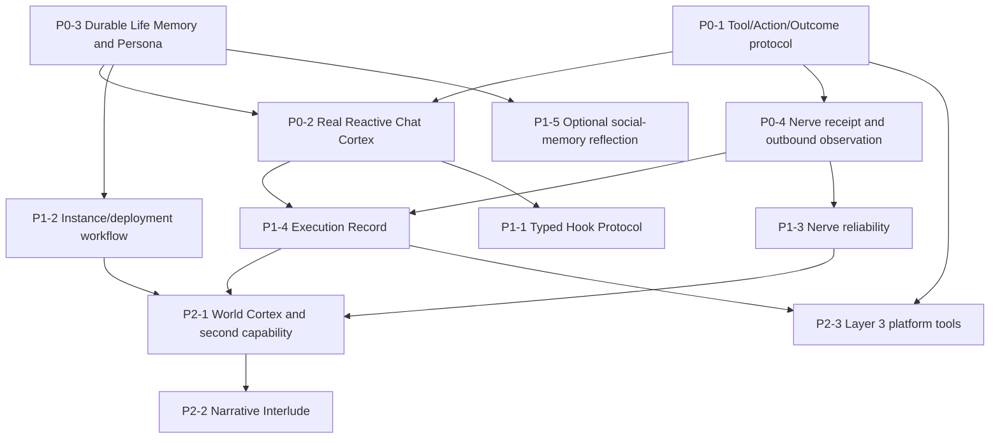

# Athena Harness：从 runtime 走向 native digital-life platform 的综合研究

> **研究日期**：2026-08-22  
> **范围**：Athena 当前源码与正式 `docs/`，以及本目录六份分报告所追溯的 Cordis、Koishi、AstrBot、CyberGroupmate、MaiBot、NachoBot 源码。未把已废弃 `.specify/specs/` 当作现状。  
> **权威顺序**：Athena 当前代码 > 当前正式 docs > 分报告中的原始项目源码证据 > 设计/路线图推断。  
> **标记**：**[事实]** 可由源码或正式 docs 直接证明；**[推断]** 由事实导出；**[评价]** 价值判断；**[建议]** 后续选择。置信度为高/中/低，不把功能数量等同于架构先进性。

---

## 1. 执行摘要

### 1.1 结论先行

**[事实，高] Athena 当前已经是“正确的骨架”，不是“完成的平台”。** 它已把 `Life`（identity）、`Cortex`（完整 survival strategy）、`Nerve`（world connection）设为领域原语；实现了 one-Cortex-per-Life、`{ life, cortex, message, satori }` 的 per-Life isolate、以及由 `MessageService` 做 Satori event ownership filter。可是唯一 `CortexChat` 仍仅 echo，`MemoryStub.search()` 恒为空，`ctx.tools`、Hook Protocol、持久 Persona/Memory、World/Interlude Cortex、Instance 文件与 Execution Record 都尚未落地。

**[推断，高] Athena 与六个项目的本质差异不在于“也能接 LLM/多平台”，而在于 identity、strategy、world interface 的 ownership 是否能独立演化。** Koishi/AstrBot/NachoBot/MaiBot/CyberGroupmate 的稳定运行单元分别偏向 plugin application、message pipeline、ChatStream/HeartFlow、session HeartFlow、chat-bound social subagent；Cordis 是无领域语义的 composition kernel。Athena 则目标为可同时部署多个拥有独立 identity、Memory、Cortex、Nerve 的 Life。该差异已在 Athena 的隔离和绑定代码中有部分实现，但尚未由非 IM Cortex 与跨重启连续性证明。

### 1.2 Athena 最重要三项优势

| 优势                                               | 结论与影响                                                                                                                                                                                | 关键证据                                                                                                                   | 置信度 |
| -------------------------------------------------- | ----------------------------------------------------------------------------------------------------------------------------------------------------------------------------------------- | -------------------------------------------------------------------------------------------------------------------------- | ------ |
| 1. **领域边界正确**                                | **[事实/评价]** `Life/Cortex/Nerve` 使“我是谁”“如何活着”“在哪里存在”分离；Cortex 是整体替换的 strategy，不是可无限拼接的 message handler。它避免了将 conversation/session 误当 identity。 | `docs/00-overview.md:9-37`；`docs/01-design-philosophy.md:35-120`；分报告 §1、§9                                           | 高     |
| 2. **依赖倒置与 IM 去中心化已落地**                | **[事实]** Cortex 面向 capability，不能依赖 `nerve-*`/adapter；Satori 被封在 `ctx.message`，并非 core Context 的继承基质。这样非 IM Nerve 有结构上的平等入口。                            | `docs/02-architecture.md:142-149,414-459,880-892`；`plugins/capability-message/src/index.ts:41-68`                         | 高     |
| 3. **多 Life 事件/Service ownership 有可执行约束** | **[事实]** `Life.bind()` 拒绝第二 Cortex；MessageService 先核验 bot 的 `satori` isolate，再以 `[Context.filter]` 将 session 只交给同一 `message` isolate。                                | `plugins/life/src/life.ts:35-45`；`packages/protocol/src/cortex.ts:10-13`；`plugins/capability-message/src/index.ts:49-68` | 高     |

### 1.3 最需补齐三项能力

| 缺口                                                 | 为什么是平台前提                                                                                                                                                                           | 关键证据                                                                                                               | 优先级 |
| ---------------------------------------------------- | ------------------------------------------------------------------------------------------------------------------------------------------------------------------------------------------ | ---------------------------------------------------------------------------------------------------------------------- | ------ |
| 1. **真实 Reactive Cortex cognition/enactment**      | 没有 willingness、aggregation、per-conversation serialization、LLM failover、`wait` 与 action feedback，当前系统仍只是隔离正确的 echo demo。                                               | `plugins/cortex-chat/src/index.ts:25-43`；`docs/06-progress-and-roadmap.md:231-255`                                    | P0     |
| 2. **Life-scoped durable Memory/Persona/self-model** | 只有跨重启、跨 Cortex 的 identity state 才能让 Life 不是启动配置；短期 conversation 不能替代它。                                                                                           | `plugins/life/src/life.ts:4-18,48-52`；`docs/01-design-philosophy.md:47-62`；`docs/06-progress-and-roadmap.md:258-290` | P0     |
| 3. **Tool/Action/receipt/trace boundary**            | LLM 暴露 action 前必须有 scope discovery、typed execution、authorization/guard、idempotency/correlation、outcome/Execution Record，否则全球 registry 或 adapter ack 会变成不可审计副作用。 | `docs/02-architecture.md:720-753`；`docs/06-progress-and-roadmap.md:59-68,193-229`；06 NachoBot §A5                    | P0     |

### 1.4 最值得借鉴三项外部设计

1. **[建议，高] MaiBot 的 per-session queue、interrupt/debounce、outbound receipt 后再写回 Memory 的因果纪律**：借其并发与 feedback 工程，不借其 global persona/host singleton。证据：`05-maibot.md` §5–6，尤其 `src/maisaka/runtime.py:1664-1826`、`src/services/send_service.py:824-968`。
2. **[建议，高] CyberGroupmate 的分层 social Memory、慢速 Reflection、输出自回灌与 adapter backfill watermark**：作为可选 Life extension/Nerve reliability protocol，而非 core social schema 或 global Meta。证据：`04-cybergroupmate.md` §3–6，尤其 `memory-v2.ts:369-479`、`reflection.ts:225-610`。
3. **[建议，高] Cordis/Koishi 的 managed configuration tree、Fiber-owned cleanup、loader lifecycle/daemon 运维经验**：用标准 `plugin-group`/`plugin-include` 实现 Instance，不自建第二 DI/loader。证据：`01-cordis.md` §6–7；`02-koishi.md` §7；`docs/02-architecture.md:757-829`。

### 1.5 最需避免三项风险

1. **[风险，高] event → response 成为核心**：一旦把 global pipeline、middleware 或 Session reply 自动化为中心，World/Interlude 将沦为插件补丁，直接触发退化测试。证据：`docs/00-overview.md:156-166`；`docs/01-design-philosophy.md:177-228,457-485`；02 Koishi §5、03 AstrBot §2。
2. **[风险，高] 用 session/chat key/global singleton 代替 Life ownership**：会重演 NachoBot/MaiBot/CyberGroupmate 的单 persona、跨主体状态泄漏或跨平台污染。证据：04 Cyber §3；05 MaiBot §3；06 NachoBot §3、§A6。
3. **[风险，高] 把 Cordis isolate 当 security/tenancy boundary，或把 Fiber reload 当 Cortex hot-swap**：isolate 只隔离 Service Symbol lookup；Cortex state 不兼容时必须显式 stop/start，不能暗示无损迁移。证据：01 Cordis §3、§6、§8；`docs/02-architecture.md:291-316`；`docs/01-design-philosophy.md:110-116`。

### 1.6 下一阶段结论

**[建议，高] 下一阶段应是“把已选边界变成可验证闭环”，顺序为：P0 工具/行动契约与真实 Chat Cortex → P0/P1 Life persistence 和 Instance → P1 trace/transport reliability → P2 World + 第二 capability + 无 Satori deployment。** 不应优先追求更多 adapter、更多 Agent handoff、plugin marketplace、通用 pipeline 或第三方代码 sandbox。完成第二 Cortex/第二 Nerve 前，Athena 是有前途的 runtime architecture，而非已验证的 native digital-life platform。

---

## 2. 研究方法、证据边界与关键证据索引

### 2.1 方法与边界

- **[事实]** 本报告完整阅读 01–06 六份分报告、Athena `AGENTS.md`、正式 `docs/00/01/02/06` 与当前关键源码（Life、Cortex base、MessageService、CortexChat、AIService、SandboxNerve）。
- **[事实]** 分报告对外部项目的事实均以其仓库的路径/symbol/行号为准；多数为静态追踪，未声称真实账号、adapter 或第三方 plugin 在本环境连通。
- **[推断]** 横向评价比较的是 ownership、runtime topology、可替换性与证据成熟度，不比较 README 宣称、插件数量或 UI 功能数量。
- **[限制]** Athena 正式 docs 含目标拓扑与代码未落地项；故报告明确区分“当前实现”“正式计划”“建议”，不把 roadmap 写成已完成事实。

### 2.2 Athena 关键证据索引

| 编号 | 事实                                                             | 原始路径 / symbol / 行                                                                |
| ---- | ---------------------------------------------------------------- | ------------------------------------------------------------------------------------- |
| A1   | 三原语、三种 Cortex 与退化测试                                   | `docs/00-overview.md:9-37,156-166`；`docs/01-design-philosophy.md:35-120,457-485`     |
| A2   | Cortex 只依赖 capability；四个 isolate key；禁止 middleware core | `docs/02-architecture.md:142-149,215-234,880-892`                                     |
| A3   | one-Cortex invariant                                             | `plugins/life/src/life.ts:35-45`；`packages/protocol/src/cortex.ts:10-13`             |
| A4   | Satori event ownership filtering                                 | `plugins/capability-message/src/index.ts:41-68`；`docs/02-architecture.md:320-410`    |
| A5   | 当前 chat 只是 echo                                              | `plugins/cortex-chat/src/index.ts:25-43`                                              |
| A6   | Memory/persona 尚未连续                                          | `plugins/life/src/life.ts:4-18,48-52`                                                 |
| A7   | AI provider/model resolution 已实现且全局共享                    | `packages/ai/src/service.ts:68-76,118-144,183-201`；`docs/02-architecture.md:610-718` |
| A8   | Sandbox 的 root Hub + per-Life Nerve 模式                        | `plugins/sandbox-nerve/src/index.ts:12-47,54-143`；`docs/02-architecture.md:534-606`  |
| A9   | Tool、Hook、Instance、Execution Record 尚未完成                  | `docs/06-progress-and-roadmap.md:55-68,193-255,258-323`                               |

---

## 3. 横向比较矩阵

| 维度            | Cordis                                  | Koishi                             | AstrBot                             | CyberGroupmate                          | MaiBot                                | NachoBot                                 | Athena Harness（当前）                                   |
| --------------- | --------------------------------------- | ---------------------------------- | ----------------------------------- | --------------------------------------- | ------------------------------------- | ---------------------------------------- | -------------------------------------------------------- |
| 核心定位        | composition kernel                      | chatbot plugin platform            | multi-platform Agent chatbot        | 群聊 social Agent application           | 人格化聊天 Agent                      | 多平台聊天 Agent                         | digital-life runtime skeleton                            |
| runtime model   | Context/Service/Fiber graph             | Satori Context + Processor/Command | global managers + EventBus pipeline | global Meta + per-chat Subagent/Sandbox | per-`session_id` HeartFlow            | global ChatBot + ChatStream/HeartFlow    | Cordis root + isolated Life group                        |
| event model     | generic push events；无 queue guarantee | Session → middleware → reply       | event queue → fixed stages          | adapter → NC → attention/queues         | envelope → session HeartFlow queue    | BaseMessage → ChatStream                 | capability push event；Cortex 自管 buffer                |
| context model   | scope/inject/isolate                    | Session + user/channel state       | UMO/profile/conversation            | chat/user/group/global state            | session + global config               | stream + global config                   | Life + Cortex-local context + capability scope           |
| Memory/Persona  | 不负责                                  | user/channel/binding DB            | Persona policy + UMO conversation   | SQLite social graph/reflection          | DB history + profile/memory injection | history/mid-long memory + global persona | inline persona + MemoryStub；无 persistent self-model    |
| LLM             | 不负责                                  | core 未见 LLM runtime              | mature agent/tool-loop/fallback     | Meta + CodeAct、多 profile              | planner/tool loop                     | planner JSON + replyer                   | AIService/provider 已有；Cortex 未接 LLM                 |
| Tool/Action     | Service/event，无 action semantics      | command/action/Session.send        | global ToolSet/MCP/builtin          | sandbox host-call/CodeAct               | per-heartflow ToolRegistry            | global ActionRegistry                    | Layer 1 message；Layer 2/3 与 ctx.tools 未实现           |
| 多平台统一      | 无偏好                                  | Satori Bot/Adapter/Session         | Platform/AstrMessageEvent           | PlatformAdapter/`nc.message`            | Platform IO envelope                  | wire `BaseMessageInfo`                   | Satori 被封于 Message capability；非 IM 尚未实现         |
| 多实体隔离      | Service namespace，不是安全隔离         | bot/account/channel routing        | UMO/profile policy                  | chat/user key + global control plane    | session key + global services         | stream key + singleton                   | per-Life service/event ownership 已实现                  |
| 主动性/持续运行 | timer 可由插件实现                      | 可主动调用 API，非 core rhythm     | Cron stimulus                       | attention/idle/cron/reflection          | wait/proactive session loop           | wait/focus/mood task                     | World/Interlude 仅计划                                   |
| 扩展性          | inject/provide/Fiber/loader tree        | plugin/loader/HMR ecosystem        | Star/plugin/MCP/hook                | adapter/skills/MCP，central bootstrap   | plugin RPC/hook/runner                | adapter/plugin/action registry           | capability/Cortex/Nerve roles；tools/hooks 未完成        |
| 平台化程度      | 高（通用基础设施）                      | 高（bot application）              | 高（Agent chatbot）                 | 中（单产品强）                          | 中（单产品强）                        | 中（单产品强）                           | 低至中（架构强，验证面少）                               |
| 主要风险        | isolate/reload 被过度解读               | IM inheritance、middleware中心     | global registry/pipeline中心        | global Meta、CodeAct trust boundary     | global singleton、chat-centric memory | global config、untyped adapter metadata  | 文档大于代码；Memory/cognition/action/observability 空白 |

**矩阵依据**：01 Cordis §1–9；02 Koishi §1–9；03 AstrBot §1–9；04 CyberGroupmate §1–9；05 MaiBot §1–9；06 NachoBot §1–9；A1–A9。  
**[评价，高]** Cordis/Koishi/AstrBot 在各自目标上的成熟度目前显著高于 Athena；Athena 的领先仅限于 digital-life 的边界设计与已完成的 per-Life ownership，不应被表述成整体产品领先。

---

## 4. Athena 设计判断

### 4.1 已确认先进设计

| 判断                                                                                                                                                                           | 证据                                                               | 置信度 |
| ------------------------------------------------------------------------------------------------------------------------------------------------------------------------------ | ------------------------------------------------------------------ | ------ |
| **[事实/评价] Life 不等于 Persona config 或 conversation**。Life 承诺跨进程、Cortex、Nerve 连续，避免把 UMO/ChatStream/session 作为身份本体。                                  | A1；03 AstrBot §3；05 MaiBot §3；06 NachoBot §3                    | 高     |
| **[事实/评价] Cortex 为整体替换 unit 是正确抽象**。Rhythm、integration、cognition、enactment、continuation 强共变，固定 pipeline 或轴式 builder 会迫使所有形态变成 Chat 变体。 | `docs/01-design-philosophy.md:66-116`；02 Koishi §5；03 AstrBot §2 | 高     |
| **[事实] Capability/Nerve inversion 已具有代码护栏**。MessageService 包住 Satori；Cortex 只 `inject: [life,message]`；Nerve/adapter 才接触 Satori domain。                     | A2、A4、A5                                                         | 高     |
| **[事实] 多 Life 的 Service 与 event ownership 不是约定而是代码路径**。                                                                                                        | A3、A4                                                             | 高     |
| **[事实/评价] root Hub + per-Life Nerve 的 Sandbox 分拆，是共享 infrastructure 与私有 Life connection 的好范式**。                                                             | A8                                                                 | 高     |

### 4.2 有潜力但尚未验证

| 判断                                                                     | 尚缺什么                                                                                         | 证据                                                                              | 置信度 |
| ------------------------------------------------------------------------ | ------------------------------------------------------------------------------------------------ | --------------------------------------------------------------------------------- | ------ |
| **[推断] push-based、Cortex-owned buffering 能兼容三种 rhythm**          | Reactive 聚合/串行、World mailbox/heartbeat、Interlude debounce 都需真实实现和测试。             | `docs/01-design-philosophy.md:177-228`；`docs/06-progress-and-roadmap.md:231-323` | 中     |
| **[推断] scoped `ctx.tools` 可以同时解决可见性与生态扩展**               | 尚无 registry/guard/execution/Layer 3 contract；还未证明 scope traversal 与 action policy 兼容。 | `docs/02-architecture.md:720-753`                                                 | 中     |
| **[推断] Instance 采用 Cordis 原语能避免自定义 loader**                  | `instances/`、persona files、真实 HMR/restart/rollback 还不存在。                                | `docs/02-architecture.md:757-829`；A9                                             | 中     |
| **[推断] AIService 适合作为共享无状态资源，Cortex 持有 failover policy** | 没有真实 Cortex 调用、cost/abort/trace/side-effect retry evidence。                              | A7；`docs/02-architecture.md:677-718`                                             | 中     |

### 4.3 当前不足

| 不足                                                                                       | 证据                                         | 置信度 |
| ------------------------------------------------------------------------------------------ | -------------------------------------------- | ------ |
| **[事实] Life 不能跨重启连续**：Memory 为 Map stub，search 空，path Persona 直接抛错。     | A6                                           | 高     |
| **[事实] 没有真实认知闭环**：CortexChat 每条非 self message 直接 echo。                    | A5                                           | 高     |
| **[事实] 没有 Tool Registry、Hook Protocol、Execution Record**。                           | A9                                           | 高     |
| **[事实] 还没有第二 capability/非 IM Cortex/无 Satori deployment**，不能证明“多世界平权”。 | A9                                           | 高     |
| **[事实] 部署/Instance workflow 仍是 docs target**。                                       | `docs/06-progress-and-roadmap.md:66,272-290` | 高     |

### 4.4 过度复杂或需重审之处

| 判断                                                                                                                | 理由与边界                                                                                                                                                                        | 置信度                                         |
| ------------------------------------------------------------------------------------------------------------------- | --------------------------------------------------------------------------------------------------------------------------------------------------------------------------------- | ---------------------------------------------- |
| **[评价] 现在不应先建通用 Cortex pipeline builder、multi-agent orchestration 或 third-party subprocess platform。** | 它们不能证明三个原语；会在首个真实 Cortex 前锁死错误主流程。AstrBot/Cyber/MaiBot 的复杂 orchestration 是应用策略，不是 Athena core prerequisite。                                 | 高                                             |
| **[评价] `LifeId = persona.name.toLowerCase()` 是 Sandbox 当前实现的临时 identity，不应成为 durable ID 规则。**     | SandboxNerve 用 persona name 作为 Hub registration key；Persona 可变、更名和跨部署迁移会冲突。应在 persistent Instance identity 落地时改为 stable Life ID。                       | 高；`plugins/sandbox-nerve/src/index.ts:24-37` |
| **[评价] docs 中“core 是不可卸载内核”的叙述需谨慎。**                                                               | 当前 `@athena-ai/core` 是 re-export + empty apply，真正现有 domain invariants 在 protocol/life/capability plugins。未来不能把 prelude 叙述当成已存在的 runtime enforcement。      | 高；`docs/02-architecture.md:15-18,64-66`      |
| **[评价] 不要将“直接暴露 Satori Bot”无条件扩大到全部 Cortex。**                                                     | 当前 docs 允许 `ctx.message.bots`，但未来多 Life/multi-account action authorization、receipt、Nerve-neutral contract 尚未解决。至少 LLM-facing API 必须经 typed action boundary。 | 中；`docs/02-architecture.md:472-511`；A9      |

### 4.5 docs 与代码偏差

| 偏差                                       | 当前裁定                                                                                       | 证据                                   |
| ------------------------------------------ | ---------------------------------------------------------------------------------------------- | -------------------------------------- |
| “native digital-life platform/core 已成立” | **[事实] 当前仅 skeleton**：核心 empty，Life/Mem/ChatCortex/Tools/Instances 未完成。           | A5–A9；`docs/02-architecture.md:64-66` |
| 目标 app.yml/instances/personas/data       | **[事实] 仅目标样例**，仓库不存在，path persona 不支持。                                       | `docs/02-architecture.md:757-829`；A6  |
| LLM/tool lifecycle                         | **[事实] 仅正式路线图**，AIService 已有但没有 Cortex consumer。                                | A7、A9                                 |
| “隔离保证”                                 | **[事实] Service/event ownership 已实现；[推断] 不等于 process/security/resource isolation。** | A3、A4；01 Cordis §3、§8               |

### 4.6 必须保持的硬约束 vs. 可调整细节

**必须保持（P0 architecture guardrails）**

1. Cortex 只依赖 capability；不得在运行时访问 concrete Nerve/adapter/Satori runtime（类型级引用可作为过渡），不建立 framework-level automatic event→response pipeline（A2）。
2. 每 Life 至多一个 Cortex；Cortex replacement 是显式 stop/start，Life Memory 连续而 Cortex-internal state 可丢（A3；`docs/01-design-philosophy.md:110-116`）。
3. `{life,cortex,message,satori}` 在 multi-Life group 隔离；禁止 `ctx.mixin()` 作为多实例 API（A2；`docs/02-architecture.md:291-316`）。
4. framework 不提供万能 inbox；push events 的 buffer/queue/lock 是具体 Cortex 的策略（`docs/01-design-philosophy.md:177-228`）。
5. Life identity 不可退化为 static config、session、chat key 或 root singleton（A1、A6）。

**可调整（须由契约/测试收敛）**

- Memory backend（SQLite first、text/vector/structured/hybrid 的组合）、self-model representation 与 retention policy。
- `WorldEvent`、ActionResult/receipt、Execution Record 的具体 schema；但必须保留 life/nerve/account/conversation/provenance/correlation。
- Hook payload 的初始抽象深度，先以 Reactive Cortex 证明，再泛化。
- Instance YAML 的组织、adapter reload、multi-Life shared Bot policy、Layer 3 tool naming/visibility。
- Cortex 内部 preset、per-conversation aggregation 算法、willingness policy、model group 选择；这些属于 Cortex implementation，不属于 framework global rule。

---

## 5. 值得借鉴的设计：借鉴、适配、反例与不建议

| 分类           | 来源                  | 设计/解决问题                                                                                  | 对 Athena 的影响                                                                                        | 代价与风险                                                              |
| -------------- | --------------------- | ---------------------------------------------------------------------------------------------- | ------------------------------------------------------------------------------------------------------- | ----------------------------------------------------------------------- |
| **可直接借鉴** | Cordis                | Fiber effect/disposer、dependency-driven activation、loader group/include                      | 统一 timer/socket/abort cleanup；Instance 不重造 loader                                                 | 不把 Fiber 生命周期误当领域状态迁移；01 Cordis §6–7                     |
| **可直接借鉴** | Koishi/Satori         | normalized content model、adapter protocol 分层、daemon/loader 运维                            | 放在 IM Nerve/transport，不污染 Cortex                                                                  | 不继承 Satori Context，不复制 Processor core；02 Koishi §2、§7          |
| **可直接借鉴** | MaiBot                | per-conversation serial executor、interrupt/debounce、bounded internal rounds、delivery 后回写 | 为 Reactive Cortex 形成可测 concurrency/feedback recipe                                                 | queue 必须是 Cortex-local，不能升级为全框架 mailbox；05 MaiBot §5–6     |
| **可直接借鉴** | CyberGroupmate        | output self-ingestion、backfill/reconnect traits、Reflection checkpoint                        | 定义 outbound observation、Nerve reliability 与慢速 consolidation                                       | “发送尝试”不可视为 delivery 成功；04 Cyber §2、§5–6                     |
| **适配后借鉴** | AstrBot               | UMO 的稳定 conversation routing key、provider fallback、context guard、plugin unload ownership | 使用 `lifeId/nerveId/accountId/conversationId` 作为 Cortex context key；把 resilience 下沉 Cortex/Nerve | UMO 不得成为 Life ID；global ToolSet 不得照搬；03 AstrBot §3–6          |
| **适配后借鉴** | CyberGroupmate        | PersonIdentity + Relation + SocialContext 分层                                                 | 做为 `plugin-social-memory`，由 Life owner 与 visibility/provenance policy 约束                         | 不能固化群聊领域词为 core schema；04 Cyber §3、§9                       |
| **适配后借鉴** | NachoBot              | action plan 的 serial/parallel、effect permit、发送阶段划分                                    | Cortex action scheduler 可声明 dependency、parallel-safe、idempotency                                   | 不采用 global registry/untyped `additional_config`；06 NachoBot §5、§A5 |
| **仅作反例**   | AstrBot/Koishi        | global pipeline/middleware becomes brain                                                       | 明确测试“无 response”“无 input cycle”“second capability”                                                | 固定 stage list 会使 Cortex 不可替换；02 Koishi §5；03 AstrBot §2       |
| **仅作反例**   | MaiBot/NachoBot/Cyber | global persona/config/service singleton                                                        | 强制 Life-scoped identity/memory/action policy                                                          | 不因数据库共享就把 ownership 做成全局；04/05/06 各 §3                   |
| **明确不建议** | Cordis                | isolate = security sandbox / reload = hot swap                                                 | 不以此营销或设计 tenancy                                                                                | 同 process/event loop/global props；状态不迁移；01 Cordis §3、§6        |
| **明确不建议** | CyberGroupmate        | default CodeAct/shell/method-string host-call                                                  | 先完成 typed tools、guard、receipt，再研究高权限 execution                                              | trust boundary 与审计成本过早扩大；04 Cyber §5、§8                      |

---

## 6. 平台化能力差距

| 能力                        | 当前成熟度                | 目标                                                                         | 主要缺口                                                              | 证据                                              |
| --------------------------- | ------------------------- | ---------------------------------------------------------------------------- | --------------------------------------------------------------------- | ------------------------------------------------- |
| Life 可组合性               | **1/5 骨架**              | stable Life ID、persona/memory/self-model 可恢复，多个 Nerve 可附着          | durable identity、migration、Life ID policy、memory visibility        | A1、A6、A8                                        |
| Cortex 可替换性             | **2/5 约束已在**          | 显式 stop/start 替换 strategy，Life continuity 不丢                          | 第二 Cortex、state handoff boundary、replacement workflow             | A3；`docs/01-design-philosophy.md:104-116`        |
| Nerve/Capability 边界       | **2/5 IM + Sandbox 证明** | 多个 Nerve 实现稳定 capability、origin/act/receipt                           | 非 IM capability、typed reliability traits、ownership authorization   | A2、A8；`docs/02-architecture.md:414-469`         |
| Memory/Persona 持久化与演化 | **0/5**                   | Life-owned durable store/retrieve/search/self-model consolidation            | backend、schema、provenance/visibility/retention、recovery            | A6、A9；04 Cyber §3–4                             |
| Tool/Action 协议            | **0/5**                   | scoped discovery、typed execute、Layer 2/3、guard/receipt/idempotency        | `ctx.tools`、ToolCall/Result、authorization、trace                    | A9；`docs/01-design-philosophy.md:367-423`        |
| 多 Life 隔离                | **3/5 topology**          | event/service ownership + memory/action/account isolation + deployment proof | persisted namespace、action authorization、shared Bot policy          | A3、A4；`docs/06-progress-and-roadmap.md:342-359` |
| 多平台事件统一              | **2/5 IM-only**           | equal IM/world/audio/expression contracts                                    | second capability、normalized origin/reliability traits               | A4；`docs/06-progress-and-roadmap.md:294-323`     |
| Instance/deployment         | **0/5**                   | portable declarative Life composition、load/reload/recover                   | actual `cordis.yml/app.yml/instances/personas/data`                   | `docs/02-architecture.md:757-829`                 |
| 开发者体验                  | **2/5**                   | recipes, config validation, test command correctness, examples               | `yarn test` false green、no Instance examples、tool/hook docs pending | `docs/06-progress-and-roadmap.md:70-90,115-123`   |
| 观测/调试/恢复              | **1/5**                   | Execution Record across cycle/model/tool/action/receipt; checkpoint recovery | no domain trace/action outcome/replay semantics                       | A9；04 Cyber §5–6                                 |
| 行为差异化                  | **1/5 vision only**       | Chat/World/Interlude 用同一 primitive 自然共存                               | only echo Chat exists；无 World/Interlude/no-Satori proof             | A5、A9                                            |

**[评价，高]** “platformization”的真正瓶颈不是再增一个 adapter，而是把 ownership、action outcome、persistence、deployment、observability 变成可组合契约；否则只是同一 bot application 的功能扩张。

---

## 7. P0/P1/P2 开发优先级

### P0 — 先完成不可替代的身份与受控闭环

| 项   | 问题 / 修改 module-boundary                                                                                                                                                                                              | 现在做的原因与不做后果                                                                               | 验收标准                                                                                                                        | 硬约束关系                                                                              |
| ---- | ------------------------------------------------------------------------------------------------------------------------------------------------------------------------------------------------------------------------ | ---------------------------------------------------------------------------------------------------- | ------------------------------------------------------------------------------------------------------------------------------- | --------------------------------------------------------------------------------------- |
| P0-1 | **定义 Tool/Action/Outcome minimal protocol**：`packages/protocol` 定义 typed inbound origin、ToolCall/ToolResult、ActionReceipt、ExecutionRecord skeleton；新增 `plugin-tools` 负责 scoped register/available/execute。 | LLM 接入之前需要防止 global ToolSet、raw adapter API、无 trace side effect；拖延会固化错误权限模型。 | root/Life/sibling tool visibility 测试；每次 execute 带 `lifeId`、target、correlation、result/error；不允许 sibling discovery。 | 保持 Cortex→capability；Layer 2 由 Cortex，Layer 3 受 scope/guard；不造全局 agent bus。 |
| P0-2 | **完成真实 `cortex-chat`**：仅在 Cortex 内实现 willingness、bounded aggregation、`life/nerve/account/conversation` key 串行、AI candidates failover、Layer 2 `send_message`/`wait`。                                     | 当前 echo 不能验证 cognition/enactment；没有 serialization 会因 push events 产生重入。               | Sandbox LLM 非 echo；低意愿静默；窗口多消息一次 cycle；同 key 不重入；失败 warn 不杀 Cortex；多 Life persona 不串。             | queue/lock 属 Cortex；不将 agent loop 放进 MessageService/AIService。                   |
| P0-3 | **Life durable Memory/Persona baseline**：MemoryProvider SQLite、stable Life ID、persona file loading；记录 lifeId/source/visibility/time/provenance。                                                                   | 这是 identity continuity 的最低条件；不做则 Life 仍是 transient config。                             | restart 后 retrieve/search/persona 一致；Cortex replacement 后 Memory 仍可读；跨 Life 与默认跨 conversation 读取拒绝。          | Life owner；短期 chat buffer 不是 Memory；不让 global store 代替 scope。                |
| P0-4 | **Nerve receipt 与 outbound observation**：Message capability/IM Nerve 返回 accepted/delivered/failed 的结构化结果，并将自身输出回投 observation。                                                                       | 避免把 `createMessage` resolve 或 adapter log 误写成 delivery；支撑 Memory 写回和 action trace。     | action 有 correlation/idempotency key；失败不写 success memory；outbound observation 可被 Cortex/Memory 识别。                  | Cortex 不直接访问 adapter；Nerve 兑现 capability，Cortex 决定后续。                     |

### P1 — 将闭环变为可部署、可运营、可扩展的 Life

| 项   | 问题 / 修改 module-boundary                                                                                                       | 原因 / 不做后果                                                     | 验收标准                                                                                | 硬约束关系                                                          |
| ---- | --------------------------------------------------------------------------------------------------------------------------------- | ------------------------------------------------------------------- | --------------------------------------------------------------------------------------- | ------------------------------------------------------------------- |
| P1-1 | **Hook Protocol**：在 protocol 声明五个 typed hooks；参考 `before-enact` guard plugin。                                           | 让扩展绕开 Cortex internals；否则插件只能侵入或复制 loop。          | typed hook payload；bail 阻止一次 action；waterfall 注入 context；未发 hook 静默。      | Hook 为可选约定，不能把 Cortex 切成 mandatory pipeline。            |
| P1-2 | **Instance/deployment control plane**：真实 `cordis.yml/app.yml/instances/personas/data`，使用 standard include/group/isolate。   | 没有 portable composition，就无法证明多 Life 可部署/恢复。          | 两个 Life 独立配置/Memory/account；停止一个 group 不影响 root AI/Hub；可复制实例。      | 不自建 loader；Cortex reload 不假设 state migration。               |
| P1-3 | **Message/Nerve reliability**：connection status、backfill watermark、dedupe、target address、delivery receipt。                  | 真实 IM 不是 `send()` 成功即交付；避免历史缺口/重复 action。        | reconnect/backfill policy 明示；重复 inbound 不重复 cognition；receipt trace 可查询。   | 作为 Nerve implementation details，Cortex 只见 capability outcome。 |
| P1-4 | **Execution Record/observability**：trace `trigger → integration → model attempts → tools/actions → receipts → state mutations`。 | 没有它无法调试 autonomous cycle、成本、Memory mutation 或恢复行为。 | 可关联一次无回复/失败/成功 cycle；不依赖 raw log 才能还原。                             | 不把 Cordis logger 误称为领域 trace。                               |
| P1-5 | **optional social-memory extension**：person/relation/social-context + slow Reflection checkpoint。                               | Companion 场景需要关系连续性，但不是所有 Life core 必需。           | visibility/provenance/revision；LLM failure 不推进 checkpoint；可卸载不伤 core Memory。 | 不将 group/chat social schema固化进 Life core。                     |

### P2 — 证明“不偏爱 Chat”并扩展生态

| 项   | 问题 / boundary                                                 | 原因 / 验收                                                              | 硬约束关系                                                   |
| ---- | --------------------------------------------------------------- | ------------------------------------------------------------------------ | ------------------------------------------------------------ |
| P2-1 | `cortex-world` + 第二 capability（优先 Minecraft 或最小 world） | heartbeat/mailbox、原生 perception、action/receipt；不装 Satori 仍运行。 | 用同一 `ctx.on`/capability pattern；非 IM 不走特殊核心路径。 |
| P2-2 | `cortex-interlude`                                              | debounce + structured output + Story DB，验证第三种 rhythm。             | Cortex 是整体替换，不做通用 builder。                        |
| P2-3 | Layer 3 platform tools 与有限 plugin ecosystem                  | 在 P0 Tool policy、P1 trace/permission 后再暴露 native Nerve action。    | 不开放 raw `method,args` 或默认 host shell。                 |
| P2-4 | process/worker sandbox / untrusted extension policy             | 仅当第三方代码、多租户或高权限 Nerve 有真实需求时设计。                  | Cordis isolate 不能作为安全边界。                            |

### 应暂缓事项（防退化清单）

- 全局 message pipeline、automatic reply contract、Cortex middleware brain、通用 queue/inbox。
- 以 chat/session/UMO/route key 作 Life ID，或 global persona/global memory 作身份容器。
- adapter-centered runtime、`Context extends satori.Context`、`ctx.mixin`/`ctx.bots` convenience 回归。
- 把 static persona 文件、conversation JSON、LLM summary 宣称为完成的 Life Memory。
- 先上 CodeAct/shell/default host tools、multi-agent handoff、plugin marketplace、第三方 subprocess runtime。
- 在 World Cortex、第二 capability、无 Satori smoke proof 前，把 Athena 宣称为已完成 native digital-life platform。

---

## 8. 按依赖关系的路线图

### Short-term（串行主线；P0）

1. **Prerequisite**：冻结四个 guardrail（per-Life isolate、one Cortex、capability inversion、no global event→response）。
2. **Milestone S1**：P0-1 minimal Tool/Action/Outcome contract；可并行实现 unit tests 与 protocol/registry，但 Action schema 先定后接 Cortex。
3. **Milestone S2**：P0-3 persistent Life baseline 与 P0-4 receipt/outbound observation 可并行；二者均完成后接 P0-2 Chat integration。
4. **Milestone S3**：P0-2 real Reactive Chat Cortex。
5. **Exit criteria**：Sandbox 中多 Life 分别以自己的 persistent persona/Memory 进行 LLM cycle；同 conversation 无重入；LLM/action failure 可见且不会杀 Life；没有自动回复时可以 `wait`/静默。

### Mid-term（P1；可在 S3 后多线并行）

- **串行依赖**：S3 的 stable cycle event/action boundary → Hook Protocol 与 Execution Record；persistent Life → Instance workflow。
- **并行项**：P1 Hook、P1 Instance、P1 Nerve reliability、P1 observability 可并行；social memory 仅在 durable core record 后开始。
- **Milestone M**：两个 Life 使用不同真实 account/instance，在重启、Nerve reconnect、group dispose/recreate 后保持正确 identity/action trace。
- **Exit criteria**：可复制 Instance；可定位一次 cognition/action/receipt/state mutation；transport failure 不被误记为 Memory success；禁用一个 Life 不影响另一个 Life 或 root infrastructure。

### Long-term（P2；以非 Chat proof 串行收敛）

1. **Prerequisite**：P0/P1 complete，尤其 durable Life、action outcome、Instance、Execution Record。
2. **Milestone L1**：World Cortex + second capability；无 Satori deployment；heartbeats 产生可观察 cycle。
3. **Milestone L2**：Interlude Cortex；验证第三种 rhythm 与 structured state mutation。
4. **Milestone L3**：受控 Layer 3 tools/optional plugin sandbox；必要时再引入 process boundary。
5. **Exit criteria**：同一 Life 可在 IM 与 world 间保持 identity；替换 Cortex 会改变行为但保留 Life Memory；无输入时仍可持续、可追踪、可恢复地行动；非 IM 不是二等路径。

---

## 9. Recurring platform principles

1. **Identity owns continuity；conversation owns local context。** `Life` 不可由 chat/session/UMO 取代。
2. **Cortex owns policy and time。** queue、willingness、rhythm、failover、action scheduling 都是 strategy，而非 framework default。
3. **Nerve owns external truth。** 平台格式、connection、backfill、receipt、capability negotiation 留在 Nerve；Cortex 只消费 stable capability contract。
4. **Capability is the inversion seam。** Cortex depends on abstractions；Nerve implements/registers concrete world connections。
5. **Scope is an ownership boundary, not a security claim。** Cordis isolate 可隔 Service/event ownership，不隔恶意代码、CPU、network、secrets。
6. **Actions are records, not merely function calls。** 所有跨世界 side effect 需要 target、correlation、state、receipt、error 与可观察的 outcome。
7. **Persistence needs provenance and policy。** memory/self-model/social facts 至少带 Life ownership、source、visibility、time、confidence/revision；可丢学习与 identity-critical mutation 分级。
8. **Extensibility must not decide the ontology。** loader/plugin/tool/hook 扩展实现，而不能把 message handler、global registry 或 product singleton 升格为 Life/Cortex/Nerve。
9. **Second shape is the proof。** 没有第二 Cortex、第二 capability、no-Satori deployment，就没有证明 platform 不偏爱 Chat。
10. **Reuse mature bricks, not their organizing assumptions。** Cordis/Satori/AI SDK/Koishi engineering 可复用；Chatbot pipeline/global bot identity 不应移植。

---

## 10. 最终回答：从 runtime 到 native digital-life platform 的具体路径

**六项目与 Athena 的本质差异**：Cordis 提供通用组合；Koishi、AstrBot、CyberGroupmate、MaiBot、NachoBot 分别将 plugin、message pipeline、global social controller、session HeartFlow 或 ChatStream 作为组织中心。Athena 的承诺是让一个 Life 的 identity 在 Cortex 与 Nerve 变动后仍保持，而 Cortex 用不同完整策略决定如何在不同世界中持续存在。

**Athena 真正先进处**：不是现有功能多，而是已经以 executable invariant 实现的 one-Cortex-per-Life、per-Life event ownership、capability/Nerve inversion 与 IM 非特权化；以及将 Cortex 覆盖节律到延续的整体 strategy 语义。

**不足、风险与过度设计**：真实 cognition、durable Memory、Tool/Action/receipt、Instance、trace、World/Interlude 皆缺；若先建 global pipeline、global persona/memory、CodeAct host 或复杂 plugin runtime，会在尚未验证核心前回退为 chatbot/application host。Cordis isolate 也绝非 security boundary。

**应借鉴/改造/避免**：借 Cordis lifecycle/loader，借 Koishi/Satori transport engineering，借 AstrBot 的 model/tool resilience，借 MaiBot 的 concurrency/feedback discipline，借 Cyber 的 slow reflection/action self-ingestion，借 NachoBot 的 action lifecycle；改造为 Life-owned、Cortex-owned、Nerve-owned contracts；避免它们的 session-centric identity、global singleton、fixed pipeline、untyped host call 与 transport-ack-as-success。

**具体路径**：先把 scoped Tool/Action/Outcome、durable Life、receipt/outbound observation 与真实 Chat Cortex 做成可验证 P0 闭环；再以 Hook、Instance、Nerve reliability、Execution Record 使其可部署和可运营；最后以 World Cortex、第二 capability、Interlude 与无 Satori deployment 验证 non-chat parity。此后 Athena 才能从“采用数字生命语言的 Cordis runtime”升级为**native digital-life platform**。
